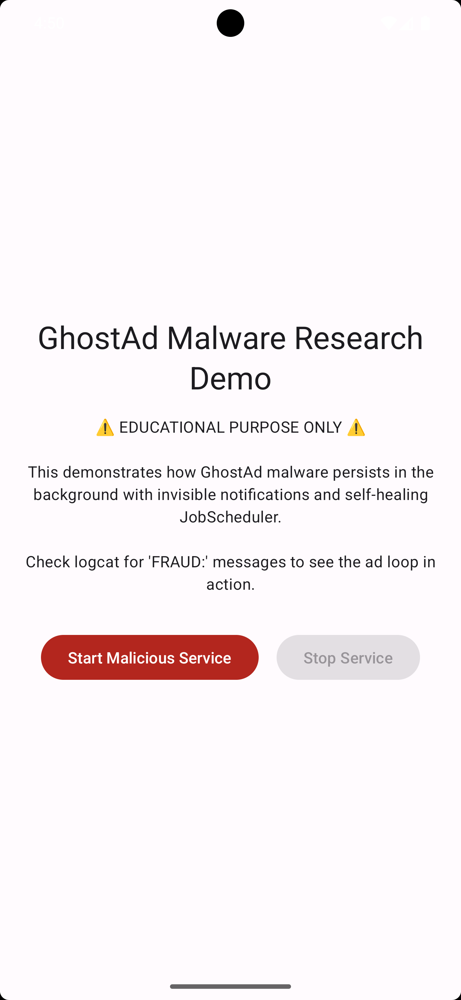
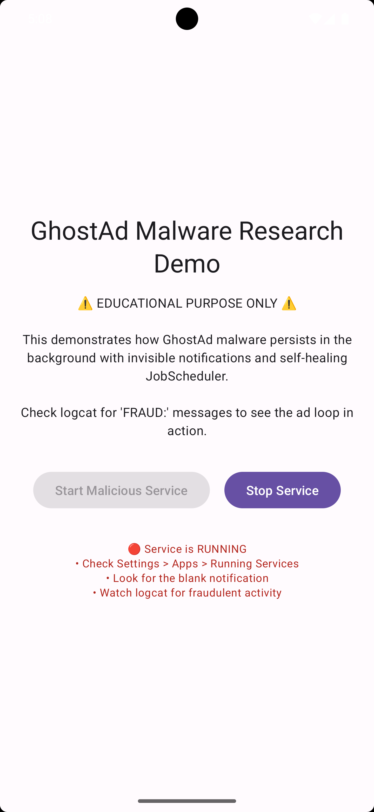

## GhostAd Malware Analysis Repository

Documenting persistent Android adware techniques that hijack devices through foreground services and background ad loops
## Overview

GhostAd represents a sophisticated category of Android malware that generates fraudulent ad revenue while evading user detection. This repository documents its technical operation based on forensic analysis, including:

- Persistent foreground services with invisible notifications
- Self-healing mechanisms using JobScheduler
- Resource-intensive ad loops exploiting legitimate ad SDKs
- Complete source code examples of malicious components

## Technical Mechanisms
#### 1. Persistent Execution via Foreground Service

GhostAd registers a foreground service immediately upon app launch, maintaining continuous execution even after app closure or device reboot. The malware exploits Android's foreground service requirements by displaying a blank, unremovable notification:

## Manifest Declaration:
```
<service
    android:name="ForegroundAdService"
    android:exported="false"
    android:foregroundServiceType="dataSync"/>
```

### Obfuscation Technique:

- Notification contains no title or message
- Visually undetectable while satisfying system requirements
- Users cannot dismiss or identify its purpose

#### 2. JobScheduler: Self-Healing Ad Engine

A secondary persistence layer ensures the ad service automatically restarts within seconds of termination:
```
// AdJobScheduler
void scheduleAdJob(Context ctx) {
    JobScheduler js = (JobScheduler) ctx.getSystemService("jobscheduler");
    JobInfo job = new JobInfo.Builder(4242,
        new ComponentName(ctx, "AdJobService"))
        .setMinimumLatency(2500L)  // Restart within 2.5 seconds
        .setOverrideDeadline(5000L) // Maximum 5-second delay
        .build();
    js.schedule(job);
}
```

### Persistence Features:

- Service ID 4242 hardcoded for identification
- Near-instant reactivation (2.5-5 second latency)
- Creates an unstoppable execution loop

#### 3. Endless Background Ad Loop

GhostAd abuses legitimate ad SDKs (Pangle, Vungle, MBridge, etc.) to generate fraudulent impressions through continuous background processing:
```
// we.i.a.a.d.invokeSuspend()
while (CoroutineScopeKt.isActive(coroutineScope)) {
    List<BdgtsPksjd> adList = xe.i.f().m(qgj.dgb.knb.a.j.a(false)).b().m();
    if (!adList.isEmpty()) {
        k.l(adList);                   // Process new ads
    }
    DelayKt.delay(6000L, this);        // Repeat every 6 seconds
}
```

### Ad Fraud Characteristics:

- 6-second refresh cycle runs indefinitely
- Processes ads without user interaction
- Queues multiple ads simultaneously
- Drains battery & consumes data continuously

### Impact on Users

Real-world device symptoms observed:

    📛 Performance Degradation: CPU overload causes device heating
    🔋 Battery Drain: Background processes consume 20-40% extra power
    📱 UI Blocking: Ads hijack foreground apps ("pop-ups every 10 seconds")
    📶 Data Theft: Unexplained mobile data consumption
    🚫 Evasion Tactics: App icon disappears during uninstall attempts

    User Reports

    "It takes over your phone like a virus – disappears when you try to uninstall while pouring ads into your phone"
    "WORST APP EVER. Blocks you from using your phone with constant pop-ups"
    "Drains battery even when phone is idle – avoid at all costs!"

Detection Indicators

    Foreground Services: Check for services with foregroundServiceType="dataSync"
    Notification Analysis: Look for blank/empty persistent notifications
    JobScheduler: Monitor for recurring jobs with 2-5 second intervals
    Ad SDK Abuse: Unusual high-frequency calls to Pangle/Vungle/MBridge APIs
    Resource Consumption: Spikes in CPU/Battery usage during device idle

Research Significance

GhostAd demonstrates how "legitimate" Android APIs can be weaponized to:

    Bypass system security safeguards
    Monetize malware through ad fraud
    Create persistent infections without root access
    Impact devices at scale (found in 100+ apps on Play Store)

### Demo
   Screen 1 |  Screen 2
:-------------------------: | :-------------------------:
 | 

### Inspiration

I got inspiration from the article "GhostAd: Hidden Google Play Adware Drains Devices and Disrupts Millions of Users " by Check Point Research, which explains how GhostAd operates and the impact it has on Android devices.

https://blog.checkpoint.com/research/ghostad-hidden-google-play-adware-drains-devices-and-disrupts-millions-of-users/


Disclaimer: This repository contains analysis only. Code samples are provided for educational purposes to help identify and mitigate GhostAd techniques.

#### License
```
MIT License

Copyright (c) 2025 Sai Tawng Pha

Permission is hereby granted, free of charge, to any person obtaining a copy
of this software and associated documentation files (the "Software"), to deal
in the Software without restriction, including without limitation the rights
to use, copy, modify, merge, publish, distribute, sublicense, and/or sell
copies of the Software, and to permit persons to whom the Software is
furnished to do so, subject to the following conditions:

The above copyright notice and this permission notice shall be included in all
copies or substantial portions of the Software.

THE SOFTWARE IS PROVIDED "AS IS", WITHOUT WARRANTY OF ANY KIND, EXPRESS OR
IMPLIED, INCLUDING BUT NOT LIMITED TO THE WARRANTIES OF MERCHANTABILITY,
FITNESS FOR A PARTICULAR PURPOSE AND NONINFRINGEMENT. IN NO EVENT SHALL THE
AUTHORS OR COPYRIGHT HOLDERS BE LIABLE FOR ANY CLAIM, DAMAGES OR OTHER
LIABILITY, WHETHER IN AN ACTION OF CONTRACT, TORT OR OTHERWISE, ARISING FROM,
OUT OF OR IN CONNECTION WITH THE SOFTWARE OR THE USE OR OTHER DEALINGS IN THE
SOFTWARE.
```

